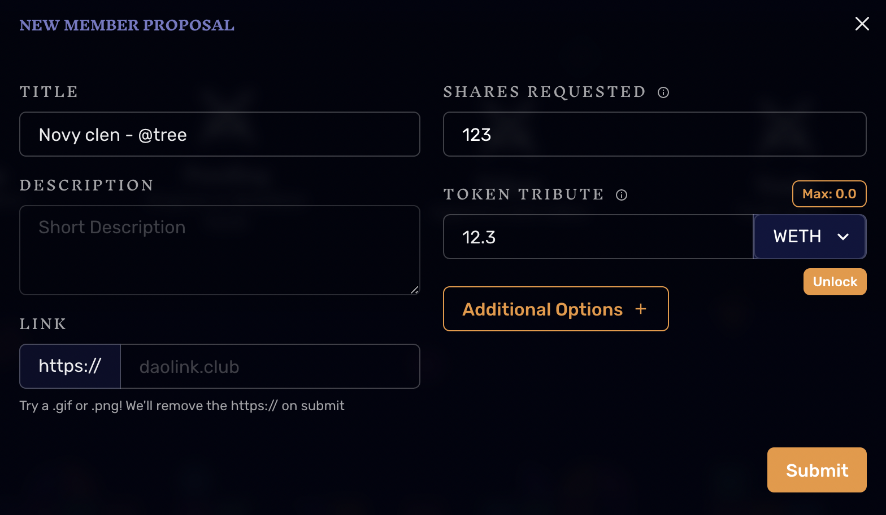

# Jak se stát členem?

**Členem BohemianDAO se může stát každý!**

Stačí vytvořit nový členský návrh (_Member Proposal_) v našem [DAO rozhraní](https://app.daohaus.club/dao/0x64/0xf762ace2c215fdad031b33c656982718c4084786/proposals/new), kde zažádáte o požadovaný podíl (_shares_) a vložíte váš odpovídající vklad (_tribute_) v Etheru, resp. Wrapped Etheru.

**1 share = 0.1 WETH**

* Minimální množství share je stanoven na 1
* Pro počet shares používejte jen celá čísla


Pokud zadáte špatný počet shares vůči vložené hodnotě, bude váš návrh zamítnut a váš vklad navrácen.


## **Postup jak se připojit do DAO**

1. [Převeďte si WETH na xDai blockchain](navody/xdai-blockchain.md#prevod-etheru-eth-na-xdai)
2. [Obstarejte si XDAI tokeny na placení transakčních poplatků](navody/xdai-blockchain.md#jak-ziskat-xdai-na-transakcni-poplatky)
3. Vytvořte Membership Proposal v našem [DAO rozhraní](https://app.daohaus.club/dao/0x64/0xf762ace2c215fdad031b33c656982718c4084786/proposals/new):
   1. Jako název návrhu uveďte "Novy clen - @VasNick"
   2. Do "_Shares Requested_" vyplňte požadovaný podíl
   3. Jako "_Token Tribute_" zvolte WETH a doplňte odpovídající množství WETH viz. přepočet výše
   4. Odemkněte váš WETH token
   5. Odešlete transakci pomocí _Submit_
4. Hotovo! Nyní je váš návrh ve frontě ke zpracování

