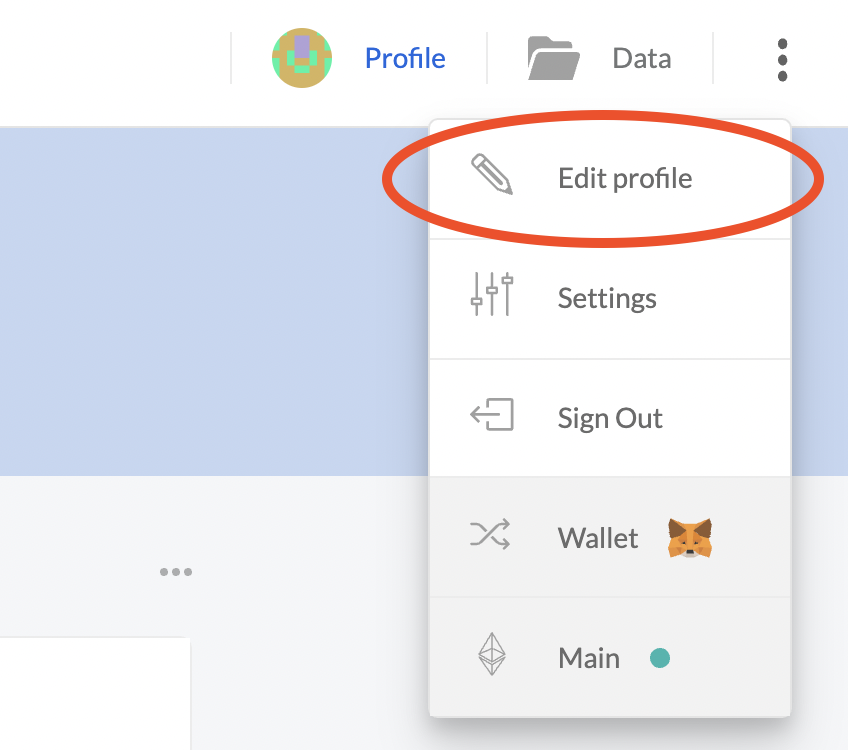
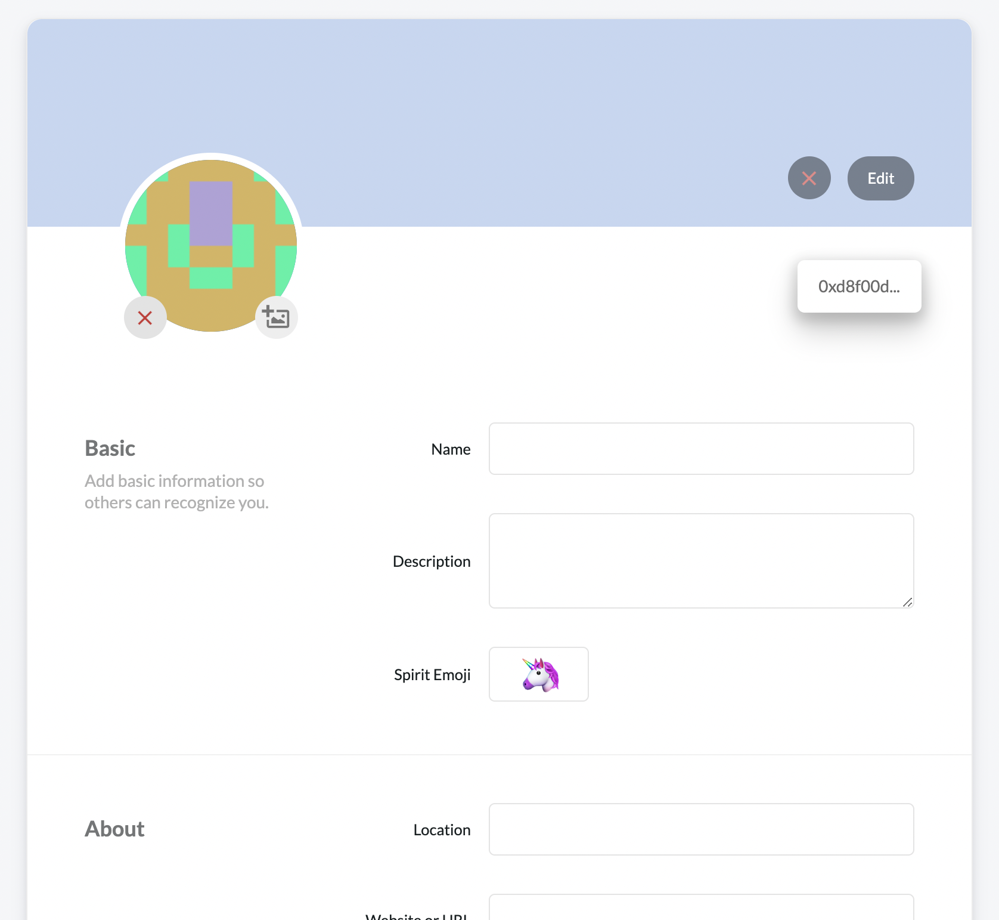

# Identifikace člena

Jako člen jste v základu identifikováni jen pomocí vaší Ethereum adresy. Pro lepší přehled a jednoduší komunitaci v rámci DAO, je dobré vytvořit si profil na platformě [3Box](https://3boxlabs.com/), která vaší Ethereum adresu propojí s vaší identitou \(nickname, avatar atp.\). Rozhodně není potřeba udávat vaše reálné jméno, bohatě stačí váš pseudonym.

Vytvoření profilu na 3Box je velmi snadné a **zdarma**. Vaše údaje budou uložené mimo blockchain a tudíž není potřeba žádná transakce a placení transakčních poplatků.


Vytvoření profilu je dobrovolné - pokud tedy chcete zůstat naprosto anonymní, tak můžete. Počítejte ale s tím, že to může komplikovat komunikaci s vámi a vaší důveryhodnost mezi členy, takže doporučujeme doplnit alespoň váš pseudonym.


## Postup pro vytvoření \(a doplnění\) 3Box profilu

1. Jděte na stránku [https://3box.io/login](https://3box.io/login) a přihlašte se pomocí vaší členské Ethereum adresy
2. Podepište zprávy o vytvoření vašeho profilu pomocí vaší peněženky
3. Jakmile bude váš profil vytvořený, klikněte na tři tečky vpravo nahoře a zvolte "_Edit profile_" \(viz screenshot níže\)
4. Doplňte informace o vás dle libosti - jako minimum doporučujeme doplnit:
   1. "_Name_" - vaše jméno či pseudonym \(nickname\)
   2. "_Avatar_" - obrázek, nebo-li avatar kterým se prezentujete
   3. Volitelně doplňte další údaje - čím více údajů doplníte, tím více budete v rámci DAO důvěryhodní pro ostatní členy
5. Po doplnění údajů nezapoměňte profil uložit tlačítkem "_Save_"

