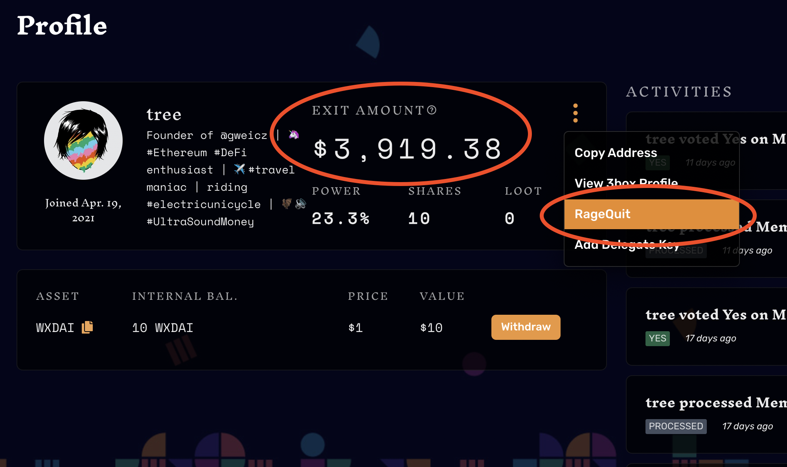

# Odchod z DAO \(ragequit\)

Jako člen máte možnost z DAO __kdykoliv vystoupit\*, včetně vašeho aktuálního finančního podílu \(_Exit Amount_\) - tato operace se nazývá _Ragequit_. Vaší výstupní hodnotu můžete vidět také na vašem profilu v DAO rozhraní.

_Ragequit_ můžete aktivovat v [DAO rozhraní](https://app.daohaus.club/dao/0x64/0xf762ace2c215fdad031b33c656982718c4084786) na vašem členském profilu, pokud kliknete na tři tečky a zvolíte "_Ragequit_" \(viz. screenshot níže\). Otevře se vám dialog, kde zvolíte počet shares, které chcete vybrat. Je tedy možné vystoupit i jen částečně.

> Příklad: v DAO banku bude 10 WETH a vy máte 10 shares z celkových 100 - to znamená že máte 10% podíl a můžete kdykoliv vystoupit s \(maximálně\) 1 WETH.


\* Jediná možnost kdy vystoupit nemůžete, je situace, kdy se zpracovává nějaký návrh, pro který jste _kladně_ hlasovali. V tomto případě musíte počkat než se návrh zpracuje.


